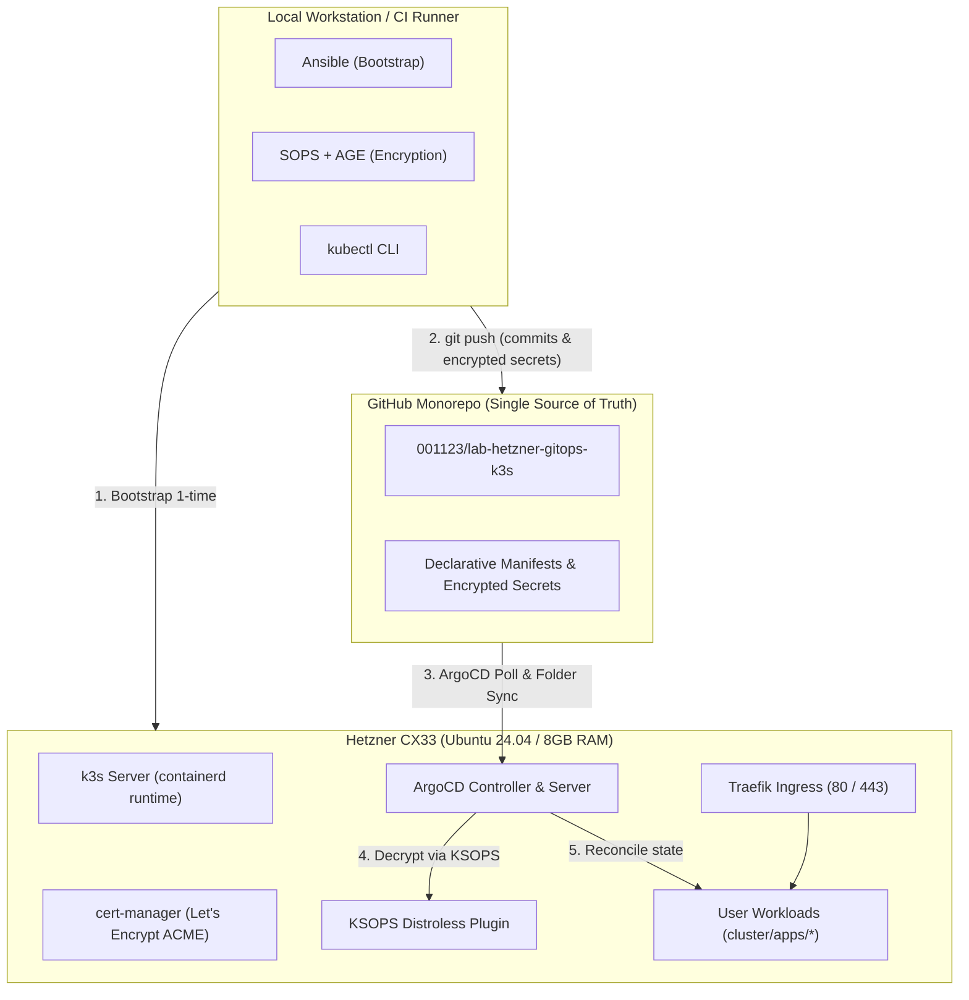

## 1. High-Level Architecture Diagram

The system operates on an asymmetric GitOps model where Git is the authoritative source of truth. Bootstrap operations are handled once by Ansible, after which ArgoCD continuously synchronizes declarative manifests to the cluster.



---

## 2. Monorepo Structure

All components live together in a single repository:

```text
lab-hetzner-gitops-k3s/
├── README.md
├── Makefile                        # Automation targets: bootstrap, sops-encrypt, validate
├── .sops.yaml                      # Path-based encryption rules & AGE recipient keys
├── .gitignore
│
├── ansible/                        # Executed strictly during Phase 1-2 bootstrap
│   ├── ansible.cfg
│   ├── inventory/
│   │   ├── hosts.yml               # hetzner-cx33-nbg target server IP
│   │   └── group_vars/
│   │       ├── all.yml             # Variables: domain, email, pinned versions
│   │       └── all.sops.yml        # Bootstrap secrets (SOPS encrypted)
│   ├── playbooks/site.yml          # Master playbook (k3s.yml + argocd.yml)
│   └── roles/                      # common, k3s_server, sops_age, argocd
│
├── cluster/                        # ArgoCD owns 100% of this directory
│   ├── bootstrap/                  # Root App-of-Apps definitions
│   │   ├── root-app/               # Entrypoint application pointing to children/
│   │   └── children/               # platform-application.yaml & apps-applicationset.yaml
│   ├── platform/                   # Core system infrastructure (one Application)
│   │   ├── cert-manager/           # Namespace, Helm release, and ClusterIssuers
│   │   ├── victoria-metrics/       # Monitoring stack (metrics storage & collection)
│   │   └── grafana/                # Dashboards UI (grafana.timi.io.vn)
│   └── apps/                       # User workloads (Git directory sync)
│       └── demo-nginx/             # Deployment, Service, Ingress, secret.sops.yaml
│
├── docs/                           # Starlight technical documentation site
├── scripts/                        # Utility scripts (sops-encrypt, get-kubeconfig)
└── .github/workflows/              # CI validation & GitHub Pages deployment
```

---

## 3. GitOps Folder Sync Mechanics

1. **Root Application**:
   The `root` Application points exclusively to `cluster/bootstrap/children/`. It never points directly to the top-level `cluster/` directory, preventing the root application from accidentally absorbing child workloads.
2. **Dynamic ApplicationSet**:
   The `apps-applicationset.yaml` manifest defines a Git directory generator with `path: cluster/apps/*`.
   * Any new folder pushed to `cluster/apps/<new-app>/` automatically spawns a dedicated ArgoCD Application.
   * Removing a folder automatically deletes and prunes the application from the cluster.
   * Auto-sync and self-healing (`selfHeal: true`) are enabled by default.

---

## 4. Deployment Ordering & Sync Waves

To prevent race conditions during first-time bootstrapping, declarative sync waves are applied:

| Tier | Sync Wave | Manifest Location | Purpose |
|---|---|---|---|
| **Cross-App Platform** | `-1` | `cluster/bootstrap/children/platform-application.yaml` | Ensures platform infra is Healthy before apps are generated |
| **Cross-App User Apps** | `0` | `cluster/bootstrap/children/apps-applicationset.yaml` | Spawns user applications only after platform services are active |
| **In-App cert-manager** | `-1` | `cluster/platform/cert-manager/` (CRDs & pods) | Guarantees CRDs are installed before ClusterIssuer resources |
| **In-App ClusterIssuer** | `0` | `cluster/platform/cert-manager/cluster-issuer.yaml` | Configures ACME issuer without transient CRD missing errors |
| **In-App VictoriaMetrics** | `0` | `cluster/platform/victoria-metrics/` | Monitoring stack (uses cert-manager for webhook certs) |
| **In-App Grafana** | `1` | `cluster/platform/grafana/` | Dashboards UI, after VictoriaMetrics (datasource + dashboard sidecar) |
