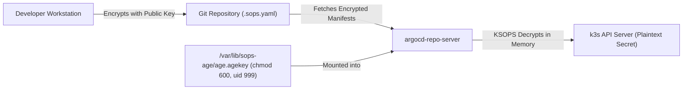

## 1. Zero-Trust Security Model

In this repository, all infrastructure and application code is publicly accessible on GitHub. To safeguard credentials, API tokens, and private certificates, we employ **SOPS** (Secrets OPerationS) backed by **AGE** asymmetric encryption.

Plaintext Kubernetes Secrets are **never** committed to Git. Instead:
1. Secrets are encrypted on the developer's workstation using an AGE public key.
2. Encrypted files (`*.sops.yaml`) are committed directly to Git.
3. In-cluster, the ArgoCD `repo-server` uses **KSOPS** to decrypt manifests in memory before applying them to Kubernetes.

---

## 2. Key Lifecycle & Permissions

The AGE key pair divides responsibilities cleanly:



* **Public Key**: Declared in `.sops.yaml` under `creation_rules`. It is safe to commit publicly.
* **Private Key**:
  * **Workstation**: Resides at `~/.config/sops/age/keys.txt`. Used for encrypting and local debugging.
  * **Server**: Deployed by Ansible to `/var/lib/sops-age/age.agekey` with strict Unix permissions (`0600`, owned by UID `999` which matches the `argocd` container user).

---

## 3. KSOPS v4.5.1 In-Cluster Integration

The KSOPS plugin is installed into the `argocd-repo-server` pod during the ArgoCD Helm installation.

:::caution[Distroless Image Gotcha (v4.5.1)]
Starting with version `4.4`, `viaductoss/ksops` is packaged as a **distroless** container image. Traditional initContainer copy scripts relying on `/bin/sh`, `cp`, or `mv` will immediately fail.

To install KSOPS v4.5.1, the initContainer must execute the built-in installer:
```bash
ksops install --with-kustomize /custom-tools
```
The `--with-kustomize` flag is mandatory because ArgoCD ships with its own bundled Kustomize binary.
:::

### Repo-Server Configuration Overview

* **Volume Mount**: Mounts `/var/lib/sops-age` from the host as read-only.
* **Environment Variables**:
  * `SOPS_AGE_KEY_FILE=/var/lib/sops-age/age.agekey`
  * `KUSTOMIZE_PLUGIN_HOME=/opt/ksops`

---

## 4. The Three Tiers of Secrets

Secrets across the repository are divided into three distinct operational domains:

1. **Bootstrap Secrets** (`ansible/inventory/group_vars/all.sops.yml`):
   Contains Hetzner API keys, ArgoCD admin password hash, and the AGE private key to place on the host.
2. **Workload Secrets** (`cluster/apps/<app>/secret.sops.yaml`):
   Application credentials, database connection strings, and runtime environment tokens.
3. **Cluster Infrastructure Secrets**:
   Cloudflare API tokens or ACME DNS credentials used by cert-manager.

---

## 5. Automated CI Safety Guards

The `.github/workflows/validate.yml` GitHub Actions pipeline enforces secret hygiene on every commit:
* Scans every YAML file to ensure no unencrypted `kind: Secret` exists.
* Runs `sops filestatus` across all `*.sops.yaml` files to verify valid cryptographic signatures.
