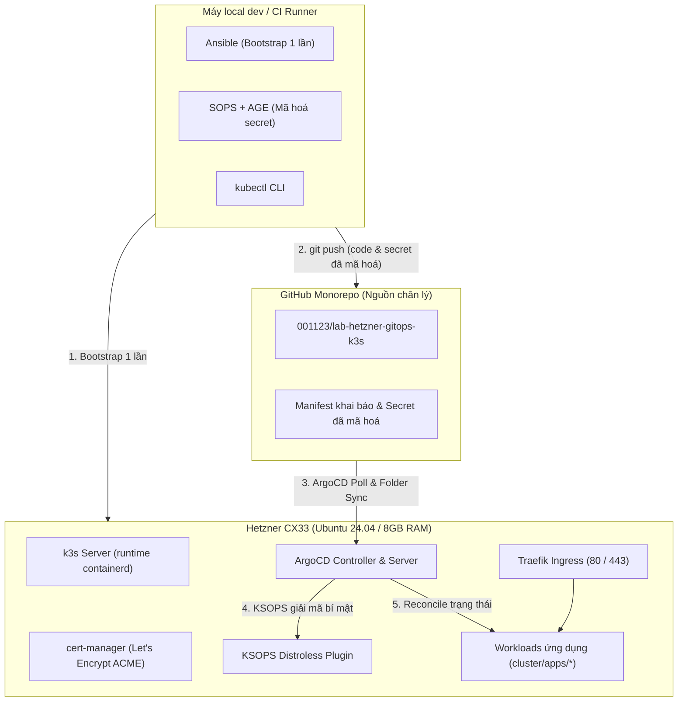

## 1. Sơ đồ kiến trúc tổng quan

Hệ thống hoạt động theo mô hình GitOps bất đối xứng, trong đó Git là nguồn chân lý tối thượng (Single Source of Truth). Quá trình bootstrap chỉ chạy 1 lần duy nhất bằng Ansible, sau đó ArgoCD sẽ liên tục đồng bộ trạng thái khai báo từ Git về cụm.



---

## 2. Cấu trúc thư mục Monorepo

Toàn bộ hệ thống được quản lý trong một kho mã nguồn duy nhất:

```text
lab-hetzner-gitops-k3s/
├── README.md
├── Makefile                        # Lệnh tự động hoá: bootstrap, sops-encrypt, validate
├── .sops.yaml                      # Quy tắc mã hoá theo đường dẫn & Public Key của AGE
├── .gitignore
│
├── ansible/                        # CHỈ dùng trong giai đoạn Bootstrap (Phase 1–2)
│   ├── ansible.cfg
│   ├── inventory/
│   │   ├── hosts.yml               # Địa chỉ IP VPS hetzner-cx33-nbg
│   │   └── group_vars/
│   │       ├── all.yml             # Biến cấu hình: domain, email, pinned versions
│   │       └── all.sops.yml        # Secret bootstrap (mã hoá bằng SOPS)
│   ├── playbooks/site.yml          # Playbook chính (k3s.yml + argocd.yml)
│   └── roles/                      # common, k3s_server, sops_age, argocd
│
├── cluster/                        # ArgoCD sở hữu 100% thư mục này
│   ├── bootstrap/                  # Khai báo Root App-of-Apps
│   │   ├── root-app/               # Application gốc trỏ vào children/
│   │   └── children/               # platform-application.yaml & apps-applicationset.yaml
│   ├── platform/                   # Hạ tầng nền tảng của hệ thống (một Application)
│   │   ├── cert-manager/           # Namespace, Helm release và ClusterIssuer
│   │   ├── victoria-metrics/       # Stack giám sát (lưu trữ & thu thập metric)
│   │   └── grafana/                # Giao diện dashboard (grafana.timi.io.vn)
│   └── apps/                       # Ứng dụng người dùng (Git directory sync)
│       └── demo-nginx/             # Deployment, Service, Ingress, secret.sops.yaml
│
├── docs/                           # Trang tài liệu kỹ thuật Starlight
├── scripts/                        # Script tiện ích (sops-encrypt, get-kubeconfig)
└── .github/workflows/              # CI validation & deploy GitHub Pages
```

---

## 3. Cơ chế hoạt động của Folder Sync

1. **Application Gốc (Root Application)**:
   Application `root` trỏ chính xác vào thư mục `cluster/bootstrap/children/`. Nó không bao giờ trỏ trực tiếp vào thư mục cha `cluster/`, nhằm tránh việc application gốc chiếm quyền sở hữu các tài nguyên con.
2. **ApplicationSet linh hoạt**:
   File `apps-applicationset.yaml` cấu hình generator dạng git directory với đường dẫn `path: cluster/apps/*`.
   * Mỗi khi bạn thêm một thư mục mới tại `cluster/apps/<ten-app>/` và commit lên Git, ArgoCD sẽ tự động tạo một Application tương ứng trên giao diện.
   * Khi xoá thư mục trong Git, ArgoCD sẽ tự động xoá bỏ tài nguyên đó khỏi cụm (auto-prune).
   * Cơ chế tự đồng bộ và tự phục hồi (`selfHeal: true`) được kích hoạt mặc định.

---

## 4. Thứ tự triển khai với Sync Waves

Để tránh xung đột phụ thuộc khi bootstrap cụm lần đầu tiên, các annotation sync wave được cấu hình chi tiết:

| Cấp độ | Sync Wave | Vị trí Manifest | Mục đích |
|---|---|---|---|
| **Liên ứng dụng (Platform)** | `-1` | `cluster/bootstrap/children/platform-application.yaml` | Đảm bảo nền tảng platform Healthy trước khi tạo app người dùng |
| **Liên ứng dụng (User Apps)** | `0` | `cluster/bootstrap/children/apps-applicationset.yaml` | Chỉ sinh ra các app người dùng sau khi platform đã sẵn sàng |
| **Nội bộ cert-manager** | `-1` | `cluster/platform/cert-manager/` (CRD & pods) | Cài đặt CRD xong xuôi trước khi áp dụng manifest ClusterIssuer |
| **Nội bộ ClusterIssuer** | `0` | `cluster/platform/cert-manager/cluster-issuer.yaml` | Thiết lập issuer ACME mà không bị lỗi thiếu tài nguyên CRD |
| **Nội bộ VictoriaMetrics** | `0` | `cluster/platform/victoria-metrics/` | Stack giám sát (dùng cert-manager cho webhook cert) |
| **Nội bộ Grafana** | `1` | `cluster/platform/grafana/` | Giao diện dashboard, sau VictoriaMetrics (datasource + dashboard sidecar) |
