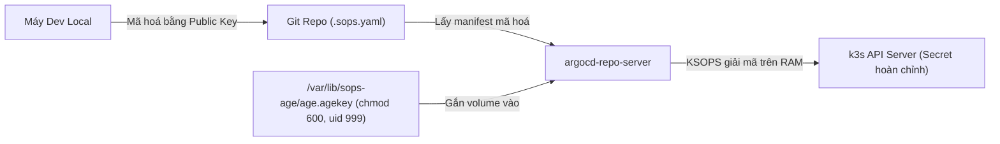

## 1. Mô hình bảo mật Zero-Trust

Trong dự án này, toàn bộ mã nguồn hạ tầng và ứng dụng được công khai trên GitHub. Để bảo vệ an toàn các thông tin đăng nhập, API token và chứng chỉ bảo mật, chúng tôi sử dụng công cụ **SOPS** kết hợp với thuật toán mã hoá phi đối xứng **AGE**.

Các Secret Kubernetes ở dạng văn bản thuần (plaintext) **tuyệt đối không bao giờ** được commit lên Git. Thay vào đó:
1. Secret được mã hoá cục bộ trên máy dev bằng Public Key của AGE.
2. File đã mã hoá (`*.sops.yaml`) được đẩy an toàn lên kho Git public.
3. Trong cụm k3s, pod `argocd-repo-server` sử dụng plugin **KSOPS** để giải mã trực tiếp trong bộ nhớ RAM trước khi đẩy vào Kubernetes API.

---

## 2. Vòng đời khoá AGE & Phân quyền bảo mật

Cặp khoá AGE phân định ranh giới trách nhiệm rõ ràng:



* **Public Key**: Được khai báo trong file cấu hình `.sops.yaml` tại trường `creation_rules`. Key này công khai và an toàn khi commit lên Git.
* **Private Key**:
  * **Máy Local**: Nằm tại `~/.config/sops/age/keys.txt`. Dùng để mã hoá secret và giải mã kiểm tra khi dev.
  * **Máy chủ VPS**: Do role Ansible triển khai tới `/var/lib/sops-age/age.agekey` với quyền truy cập nghiêm ngặt (`0600`, sở hữu bởi user UID `999` tương ứng với user `argocd` trong container).

---

## 3. Tích hợp KSOPS v4.5.1 trong cụm

Plugin KSOPS được nhúng vào pod `argocd-repo-server` trong quá trình Ansible triển khai Helm chart `argo-cd`.

:::caution[Lưu ý bắt buộc về Image Distroless (v4.5.1)]
Từ phiên bản `4.4` trở đi, image `viaductoss/ksops` được đóng gói dưới dạng **distroless** (không có sẵn `/bin/sh`, `cp`, hay `mv`). Các script initContainer dùng lệnh copy shell truyền thống sẽ lập tức báo lỗi và khiến pod crash.

Để cài đặt KSOPS v4.5.1 đúng cách, initContainer phải gọi subcommand tích hợp sẵn của binary:
```bash
ksops install --with-kustomize /custom-tools
```
Cờ `--with-kustomize` là bắt buộc vì ArgoCD đi kèm một bản Kustomize riêng (từ v4.5.1 trở đi ksops mặc định chỉ sao chép binary ksops nếu không có cờ này).
:::

### Cấu hình chính trên Repo-Server

* **Gắn Volume**: Mount thư mục `/var/lib/sops-age` từ host vào container ở chế độ Read-Only.
* **Biến môi trường**:
  * `SOPS_AGE_KEY_FILE=/var/lib/sops-age/age.agekey`
  * `KUSTOMIZE_PLUGIN_HOME=/opt/ksops`

---

## 4. Ba tầng Secret trong hệ thống

Secret trong toàn bộ repo được chia thành 3 miền vận hành độc lập:

1. **Bootstrap Secrets** (`ansible/inventory/group_vars/all.sops.yml`):
   Chứa API key Hetzner, mật khẩu quản trị ban đầu của ArgoCD và Private Key AGE để nạp lên host.
2. **Workload Secrets** (`cluster/apps/<app>/secret.sops.yaml`):
   Chứa thông tin đăng nhập database, khoá bí mật runtime của từng ứng dụng người dùng.
3. **Infrastructure Secrets**:
   Cloudflare API Token phục vụ xác thực DNS-01 cho cert-manager khi mở rộng cấp chứng chỉ wildcard.

---

## 5. Rào chắn bảo vệ tự động trên CI (GitHub Actions)

Quy trình CI `.github/workflows/validate.yml` kiểm tra tính toàn vẹn của secret trên mỗi pull request:
* Quét toàn bộ file YAML để chặn đứng bất kỳ file nào có `kind: Secret` mà chưa được mã hoá.
* Chạy lệnh `sops filestatus` trên tất cả các file `*.sops.yaml` để xác minh chữ ký mã hoá hợp lệ.
